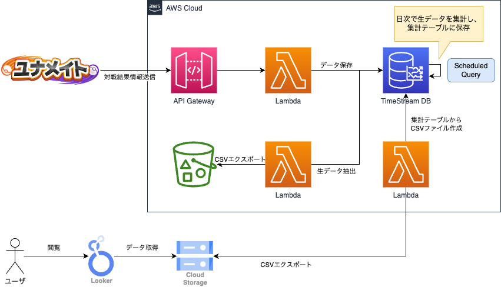

## 概要

ユナメイト対戦情報のデータ基盤システム。
looker studioにて、統計情報を公開している。

## システム設計

### システム構成図



### データの流れ
1. API Gateway -> Lambda -> TimeStream DBという構成で、APIで受信したデータをTimeStream DBに格納する。
2. 日次で生データをS3バケットにバックアップエクスポートする。
3. TimeStreamのスケジュールクエリという機能を利用し、集計を行い、集計結果用テーブルに格納する。
4. 日次起動のLambdaバッチによって、集計結果をGoogle Cloud Storage(GCS)にCSVエクスポートする。
5. Looker StudioのデータソースをGCSとして、データビジュアライゼーションする。

### API仕様書

- [API仕様書](./docs/openapi.yml)
- 以下にて、ReDocファイルを公開している。
  - https://s3.ap-northeast-1.amazonaws.com/juv-shun.website-hosting/unitemate-api/prd/redoc.html

## リポジトリ構成

本システムのAWS部分は、[serverless framework](https://www.serverless.com)を使用している。

```
.
├── docs
│   └── openapi.yml      # API仕様のswaggerファイル
├── scheduled_queries    # 集計用のSQLを管理
│   ├── aggregation        # 一次加工したデータから集計を行うクエリ
│   └── processed_origin   # 元データを一次加工するクエリ
├── serverless.yml       # serverless frameworkの設定ファイル
└── src                  # Lambda関数のPythonプログラムを管理
    ├── api                # API用のLambda関数
    └── csv_export         # CSVエクスポートする
```
